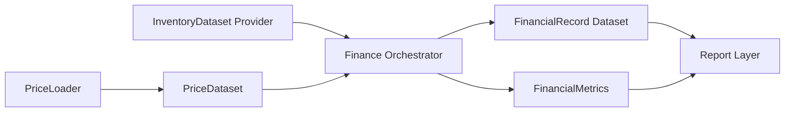
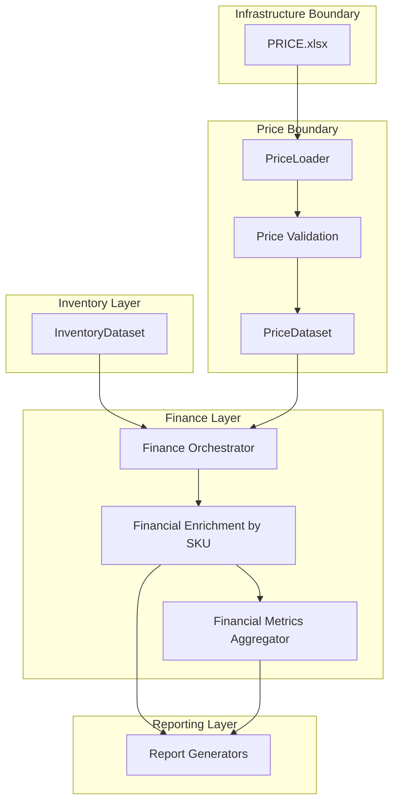
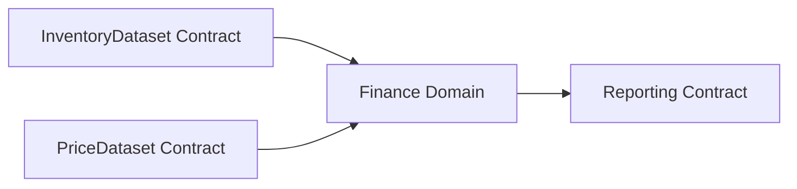

# Finance Layer Architecture

## 1. Purpose
Design a scalable Finance Layer for SVO Match Engine that sits between Inventory and Reports.

Pipeline position:
Loader -> Normalizer -> Matcher -> Business Rules -> Inventory -> Finance -> Reports

Finance design constraints:
- Finance never reads Excel directly.
- Finance receives prepared datasets only.
- Matching key for financial enrichment is SKU.
- MASTER remains product-attribute only, with no pricing fields.

## 2. Non-goals
This document does not include:
- Production code
- Calculation implementation
- Changes to Match Engine, Inventory Layer, or Reports

## 3. Layer Responsibilities

### Inventory Layer (upstream contract)
Produces InventoryDataset only. Finance does not call loaders in Inventory and does not parse source documents.

### PriceLoader (new boundary component)
Responsibilities:
- Read PRICE.xlsx from infrastructure boundary
- Validate, normalize, and publish PriceDataset
- Handle date-range and status filtering rules

Not allowed:
- Financial calculations
- Report generation
- Match logic by free text

### Finance Layer (core domain)
Responsibilities:
- Join InventoryDataset with PriceDataset by SKU
- Produce FinancialRecord rows
- Produce FinancialMetrics aggregates
- Keep deterministic, auditable transformations

Not allowed:
- Direct Excel reading
- Inventory recalculation
- Output formatting and workbook creation

### Reporting Layer (downstream)
Consumes FinancialRecord and FinancialMetrics and renders output. No formula ownership.

## 4. High-level Data Flow

1. Inventory publishes InventoryDataset.
2. PriceLoader publishes PriceDataset.
3. Finance joins by SKU.
4. Finance produces:
- FinancialRecord dataset
- FinancialMetrics summary
5. Reports render finance outputs.

## 5. Component Diagram

## 6. Dependency Diagram

Allowed dependencies:

Forbidden dependencies:
- Finance -> openpyxl
- Finance -> PRICE.xlsx
- Finance -> Inventory source files
- Finance -> report formatting

## 7. Domain Models

### 7.1 PriceRecord
One SKU price row valid for a period and channel context.

Core fields:
- sku
- unit_cost
- retail_price
- wholesale_price
- marketplace_price
- effective_from
- effective_to (nullable)
- status
- source_price_list_id (future extension)
- currency_code (future extension)

### 7.2 FinancialRecord
One finance-ready SKU row produced from InventoryDataset x PriceRecord join.

Core fields:
- sku
- master_name
- opening_stock_qty
- receipt_qty
- supplier_return_qty
- sales_qty
- calculated_stock_qty
- actual_stock_qty
- variance_qty
- unit_cost
- retail_price
- wholesale_price
- marketplace_price
- pricing_effective_from
- pricing_effective_to
- pricing_status
- pricing_source

Future calculated fields to be appended (not implemented now):
- stock_value
- supplier_return_value
- revenue
- cogs
- gross_profit
- margin
- inventory_value

### 7.3 FinancialMetrics
Aggregated metrics for reporting and regression checks.

Core fields:
- total_stock_value
- total_supplier_return_value
- total_revenue
- total_cogs
- total_gross_profit
- gross_margin_pct
- inventory_value
- sku_coverage_pct
- missing_price_sku_count
- inactive_price_sku_count

## 8. Join and Pricing Resolution Rules

Primary key:
- SKU exact match

Planned pricing selection policy:
1. Filter PriceRecord by status = Active.
2. Filter by effective date window containing valuation date.
3. Resolve ties by precedence:
- most recent effective_from
- source priority (future)

Mismatch handling policy:
- Missing price for SKU: keep FinancialRecord with pricing_status = MissingPrice.
- Multiple active overlapping prices: mark pricing_status = AmbiguousPrice and route to diagnostics.

## 9. Validation and Quality Gates

PriceDataset gate examples:
- Required columns present
- SKU non-empty
- Numeric prices >= 0
- effective_from valid date
- effective_to >= effective_from when provided
- status in allowed enum

Finance gate examples:
- Inventory rows retained after join
- Missing price share below configured threshold
- No invalid numeric outputs

## 10. Testing Strategy

### Unit tests
- PriceLoader column and type validation
- Price effective-window resolver
- SKU join behavior
- Missing and ambiguous price classification

### Integration tests
- InventoryDataset + PriceDataset -> FinancialRecord shape
- Date-effective pricing selection across boundary dates
- Channel-specific price selection readiness

### Regression tests
- Golden dataset snapshots for FinancialRecord and FinancialMetrics
- Deterministic outputs for same inputs
- Backward compatibility of model schemas

### Future financial-calculation tests
For each metric when implemented:
- Happy-path deterministic calculations
- Zero and negative edge cases
- Rounding policy tests
- Currency conversion tests (future)

## 11. Extensibility Roadmap

Phase 1: Baseline
- Single price list
- Single currency
- Flat channel prices from PRICE.xlsx

Phase 2: Price history
- Time-versioned prices
- Strict overlap validation

Phase 3: Multi-list and channels
- Contract price list
- Retail/wholesale/marketplace channel policies

Phase 4: Multi-currency
- currency_code + FX dataset boundary
- valuation currency policy

Phase 5: Commercial logic
- Discounts
- Promotions
- Marketplace fee model

## 12. Governance Notes

MASTER ownership:
- SKU and product attributes only
- No price fields

PRICE ownership:
- All commercial price attributes
- Effective periods and statuses

Finance ownership:
- Financial enrichment and aggregate metrics only

This separation preserves scalability, auditability, and independent evolution of matching, inventory, and finance domains.
